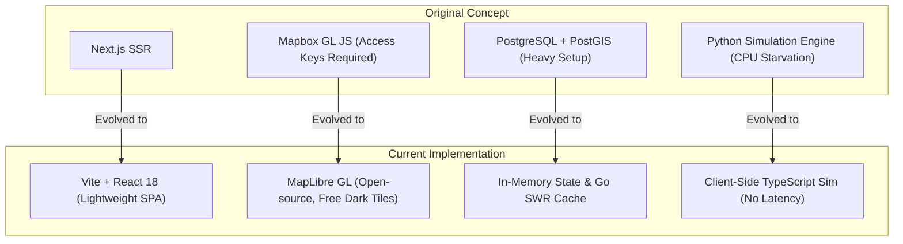
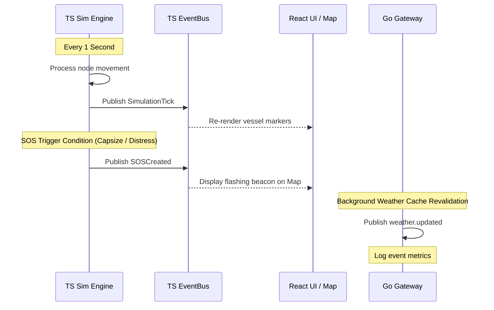

# Architecture Overview

This document serves as the canonical architecture definition for **BeaconMesh**. It describes the system topology, component interactions, technological stack, design principles, current implementation state, and future evolution roadmaps.

---

## ⚠️ Architectural Reality & Discrepancies

To maintain absolute technical integrity, developers and auditors must note that the active codebase differs from older legacy design documentation (`docs/hld.md`, `docs/lld.md`, `docs/prd.md`). Below is the truth-matrix comparing the **Legacy Design Specs** to the **Actual Implementation** as verified in the repository:

| Architectural Area | Legacy Design Spec (Outdated) | Actual Implementation (Source of Truth) |
| :--- | :--- | :--- |
| **Frontend Framework** | Next.js (App Router) | React 18 SPA bootstrapped with **Vite** |
| **Map Rendering Engine** | Mapbox GL JS | **MapLibre GL** (WebGL world map with CartoDB Dark Matter tiles) and **Leaflet.js** (tactical regional dashboard view) |
| **Database Layer** | PostgreSQL + PostGIS database | **Stateless / In-Memory**. Active states are handled in-memory inside React. The Go gateway caches weather telemetry in-memory. |
| **Mesh Simulation Engine** | Python simulation loop running event queues | **TypeScript client-side engine** running in the React browser thread (`frontend/src/simulation/`) |
| **Go Backend Scope** | Telemetry, Emergency, & Simulation controller modules | Caching proxy layer managing weather telemetry, local AIS mocks, and optimization request routing |
| **Communication Protocols** | WebSockets + gRPC | Stateless **REST APIs** (JSON over HTTP) with CORS enabled |

---

## 1. Project Vision, System Goals, & Scope

### Project Vision
BeaconMesh provides low-bandwidth, offline-first communication and rescue route optimization for vessels operating beyond cellular coverage. By modeling delay-tolerant mesh networks, coastal search and rescue (SAR) centers can coordinate dispatches during breakdowns, sinking, or medical emergencies.

### System Goals
- **Local Autonomy**: Simulate store-carry-forward packet exchanges when nodes are offline, keeping all core telemetry logic on the client.
- **Operational Clarity**: Explicitly segregate regional tactical coordination screens (the Mangalore emergency dashboard) from global maritime shipping traffic monitors.
- **Algorithmic Dispatch**: Automatically route rescue vessels to multiple emergency alerts, prioritizing medical urgency and minimizing distance under active sea state constraints.

### Core Capabilities
- **Tactical Dashboard**: Tracks and coordinates regional rescue assets and active SOS incidents, dispatching optimized plans using real-time weather constraints.
- **Surveillance Center**: Monitors 200+ simulated commercial AIS targets transiting international lanes, visualizes wave and wind overlays, and inspects specific ship parameters.
- **Simulation Control**: Provides real-time execution of store-carry-forward packet transfers, node movements, and signal range criteria directly in the browser.

---

## 2. Technology Reference & External Dependencies

### Technology Reference Table

| Layer | Technology | Purpose | Current Status |
| :--- | :--- | :--- | :--- |
| **Frontend Framework** | React 18 / TypeScript | User interface structure and client-side logic | ✅ Complete |
| **Frontend Bundler** | Vite | Rapid hot-module reloading and frontend build pipeline | ✅ Complete |
| **World Map Rendering** | MapLibre GL | GPU-accelerated world map with coordinate clustering | ✅ Complete |
| **Tactical Map Rendering** | Leaflet.js | Regional map plotting for Mangalore emergencies | ✅ Complete |
| **API Gateway** | Go 1.22 | High-concurrency telemetry cache and routing proxy | ✅ Complete |
| **Optimization Solver** | Google OR-Tools | Capacitated vehicle routing optimization with time windows | ✅ Complete |
| **Solver Host** | Python 3.11 / FastAPI | REST endpoint container exposing OR-Tools algorithms | ✅ Complete |
| **Persistence Layer** | In-Memory (SWR cache / React state) | Temporary data retention during runtime session | ✅ Complete |
| **Persistent Storage** | PostgreSQL / PostGIS | Long-term vessel track, logs, and route persistence | 🟡 Planned |

### External Dependencies
BeaconMesh relies on the following third-party services, APIs, and libraries:
- **Open-Meteo Weather & Marine API**: External REST endpoints queried by the Go backend to retrieve real-time wave heights, wave periods, wind speeds, and temperatures.
- **CartoDB Tiles**: Serves the CartoDB Dark Matter raster tiles to the MapLibre GL instance without needing access keys.
- **Leaflet.js**: Renders interactive local tactical overlays for the Mangalore regional dashboard.
- **MapLibre GL**: Renders the hardware-accelerated world vector map and handles vessel grouping clusters.
- **Google OR-Tools**: Python wrapper used to calculate routing solutions.

*Note: There are currently no third-party cloud database dependencies; the application runs fully locally in development.*

---

## 3. Architectural Evolution

The architecture of BeaconMesh evolved significantly from its conceptual design to its actual implementation. The table below documents these shifts and explains the technical reasoning behind each decision.



### Next.js ➔ React + Vite
* **Change**: Replaced the server-rendered Next.js framework with a client-rendered React Single Page Application (SPA) powered by Vite.
* **Rationale**: Eliminates the server-side rendering (SSR) overhead. Since the simulation sandbox runs entirely client-side, a clean SPA simplifies deployment, fits static hosting pipelines, and enables instant hot-module updates during development.

### Mapbox GL JS ➔ MapLibre GL & Leaflet
* **Change**: Replaced Mapbox GL JS with open-source MapLibre GL for the global map, and added Leaflet.js for the regional map.
* **Rationale**: Mapbox GL JS requires external access tokens and introduces usage billing. MapLibre GL provides open-source WebGL maps using CartoDB Dark Matter tiles. Leaflet is chosen for the tactical dashboard because it is lightweight and handles local vector markers efficiently without needing a heavy WebGL canvas.

### PostgreSQL + PostGIS ➔ In-Memory State & Go SWR Cache
* **Change**: Moved from a persistent database setup to transient in-memory state management in React and Go SWR caches.
* **Rationale**: Streamlines local developer onboarding and prototyping. Eliminates the requirement to host local databases during development, while the Go gateway handles external API cache wrappers safely.

### WebSockets ➔ REST HTTP APIs
* **Change**: Replaced persistent WebSocket connections with stateless HTTP REST endpoints.
* **Rationale**: Simplifies connection handling, avoids socket state leakages, handles cross-origin (CORS) requests cleanly, and leverages standard client-side revalidation intervals.

### Python Simulation ➔ Client-Side TypeScript Simulation
* **Change**: Ported the wireless mesh networking simulation loop from a Python container to a TypeScript engine running directly in the browser thread.
* **Rationale**: Running the simulation inside the React browser thread provides zero-latency updates to the UI, direct access to application state vectors, and avoids inter-process network overhead.

---

## 4. Current vs. Planned Architecture

To keep the release roadmaps distinct, the system is separated into the currently implemented stateless container structure and the planned persistent layout.

### A. Current Architecture (Stateless Sandbox)
The current implementation acts as a stateless, local simulation sandbox:
1. **Frontend (React + Vite)**: Houses the UI panels and the simulation engine (`dtn.ts`, `engine.ts`). It generates synthetic coordinates updates and tracks active distress dispatches in React state.
2. **Go Gateway (`backend/`)**: Acts as a lightweight proxy cache. Exposes `/api/v1/weather` (with memory caching) and `/api/v1/ais` (generating simulated commercial coordinates). It also relays optimization payloads.
3. **Python Solver (`simulation/`)**: FastAPI wrapper exposing the OR-Tools optimization worker over port `:8000`.

### B. Planned Architecture (Persistent Production Layout)
The planned architecture targets full production deployments and data retention:
1. **PostgreSQL + PostGIS**: A persistent database container will be attached to the Go API Gateway.
2. **State Migration**: The Go Gateway will write telemetry logs, active SOS dispatches, and computed routes directly to database tables, replacing transient React states.
3. **Live AIS Ingestion**: The Go `AISProvider` interface will be extended to query actual transponder networks, replacing the mock generator.

---

## 5. Deployment Architecture

The system is deployed locally across three separate ports using REST API calls over HTTP.

### Deployment Diagram (Mermaid)

```mermaid
graph TD
    subgraph User Workspace
        Browser["Web Browser (Vite Client)<br>Port :3000"]
    end

    subgraph API Gateway Layer
        GoGateway["Go API Gateway Server<br>Port :8080"]
    end

    subgraph Optimization Subsystem
        FastAPIService["Python FastAPI Service<br>Port :8000"]
    end

    subgraph External Networks
        OpenMeteo["Open-Meteo Marine/Weather APIs<br>Port :443 (HTTPS)"]
    end

    Browser -->|HTTP REST GET/POST| GoGateway
    GoGateway -->|HTTP Proxy POST| FastAPIService
    GoGateway -->|HTTP GET (10m caching)| OpenMeteo
```

### Port and Protocol Specifications
- **Vite Dev Server**: Runs on port `3000` over **HTTP**. Serves static JSX assets and stylesheets to the browser.
- **Go API Gateway**: Runs on port `8080` over **HTTP**. Exposes core endpoints and wraps them in CORS filters.
- **Python FastAPI Service**: Runs on port `8000` over **HTTP** on `127.0.0.1`.
- **Open-Meteo APIs**: Queried externally over **HTTPS** (port `443`).

---

## 6. Subsystem & Component Details

```
┌────────────────────────────────────────────────────────┐
│                   BEACONMESH MONOREPO                  │
├───────────────┬────────────────────────┬───────────────┤
│   frontend/   │        backend/        │  simulation/  │
│  (React/TS)   │          (Go)          │   (Python)    │
└───────────────┴────────────────────────┴───────────────┘
```

### 1. Frontend Subsystem (`frontend/`)
The frontend contains all rendering interfaces and local simulation engine loops.
* **`src/components/LiveMapConsole.tsx`**: The main world maritime surveillance center. Integrates the MapLibre GL engine, circle clustering layers, category filters, and ship details drawer.
* **`src/components/MapOverview.tsx`**: Renders the regional Leaflet tactical map. Plots gateway locations, simulated fishing fleets, and active rescue dispatches.
* **`src/simulation/engine.ts`**: The coordinate translation engine. Updates vessel physics, checks node distance vectors, and triggers DTN packet handshakes.

### 2. Backend Subsystem (`backend/`)
The Go backend handles external data ingestion and request dispatching.
* **`internal/weather/infrastructure/cache.go`**: In-memory cache holding weather telemetry for 10 minutes to prevent rate-limiting on Open-Meteo.
* **`internal/weather/infrastructure/openmeteo.go`**: HTTP client querying marine and weather parameters.
* **`internal/weather/infrastructure/ais_provider.go`**: Trigonometric simulation engine generating commercial vessel logs.

### 3. Simulation & Optimization Subsystem (`simulation/`)
The Python solver calculates routing assignments.
* **`src/optimizer/solver.py`**: Maps inputs into a Capacitated Vehicle Routing Problem with Time Windows (CVRPTW) model and executes Google OR-Tools.
* **`src/optimizer/costs.py`**: Computes wave and wind degradation penalties.

---

## 7. Event Flow

BeaconMesh utilizes an event-driven model to coordinate components.

### Core Event Bus Types
- **`weather.updated` (Go EventBus)**: Triggered inside the Go gateway when SWR cache revalidation successfully fetches new metrics.
- **`SOSCreated` (TypeScript EventBus)**: Fired in the client when a vessel triggers an emergency alert, updating active UI alert queues.
- **`MissionAssigned` (TypeScript EventBus)**: Fired when the coordinator dispatches an optimized rescue route, updating active mission states.
- **`SimulationTick` (Internal Frame loop)**: Dispatched every second to trigger coordinate translation updates and DTN handshakes.

### Event Flow Sequence (Mermaid)



---

## 8. Persistence Layer Design

### Current Implementation (Stateless Sandbox)
The current persistence model is transient and runs in-memory:
- **Client Cache**: Active alerts, fleet coordinates, and active dispatches exist strictly in the React app context. Refreshing the browser resets the system state.
- **Go Gateway Cache**: Open-Meteo telemetry is retained in-memory in a custom SWR Cache wrapper (`cache.go`).

### Planned Persistent Architecture (PostGIS Integration)
The planned production architecture will use a persistent database layout:
- **Spatial Tables**: Uses PostgreSQL + PostGIS schemas mapped in `docs/database_design.md` (`vessels`, `telemetry_logs`, `emergencies`, `rescue_routes`).
- **GIST Indexing**: Implements Generalized Search Trees (GIST) on spatial fields to optimize geometric queries (e.g. `ST_DWithin` for LoRa transceiver range checks).

---

## 9. Implementation Status

The table below summarizes the implementation status of all BeaconMesh subsystems:

| Subsystem | Module | Status | Description |
| :--- | :--- | :--- | :--- |
| **Frontend** | React Shell & Sidebar | ✅ Complete | Main viewport layouts and navigation panels |
| **Frontend** | Tactical Map View | ✅ Complete | Leaflet-based Mangalore tactical operations map |
| **Frontend** | Global Map Console | ✅ Complete | Fullscreen MapLibre GL map with clustering |
| **Frontend** | Simulation Engine | ✅ Complete | TypeScript client-side node movement and DTN mesh |
| **Backend** | Go Routing Mux | ✅ Complete | HTTP endpoints routing proxy and configuration |
| **Backend** | Weather Service | ✅ Complete | Open-Meteo integration and SWR cache controller |
| **Backend** | Mock AIS | ✅ Complete | Trigonometric commercial vessel position generator |
| **Backend** | Database Adapters | 🔴 Planned | Database drivers and PostGIS repository wrappers |
| **Simulation**| Python OR-Tools Solver| ✅ Complete | CVRPTW solver endpoints |
| **Simulation**| Python Sim Engine | 🟡 Partial | Local models exist, but simulation runs in frontend |
| **Database** | SQL Schemas | 🟡 Planned | Conceptual design complete; Postgres container planned |
| **Security** | Auth / Encrypted SOS | 🔴 Not Started | Signatures and credentials verification planned |
| **CI/CD** | Test Suites | 🟡 Partial | Go unit tests and Python solver tests complete; E2E tests planned |

---

## 10. References
- *Google OR-Tools VRP Solver Guide*: https://developers.google.com/optimization/routing/vrp
- *Open-Meteo API Documentation*: https://open-meteo.com/en/docs
- *MapLibre GL API Reference*: https://maplibre.org/maplibre-gl-js/docs/
- *Leaflet JS API Reference*: https://leafletjs.com/reference.html
- *BeaconMesh Architectural Decision Records*: [docs/adr/](file:///c:/Users/Gagandeep/project/BeaconMesh/docs/adr/)
