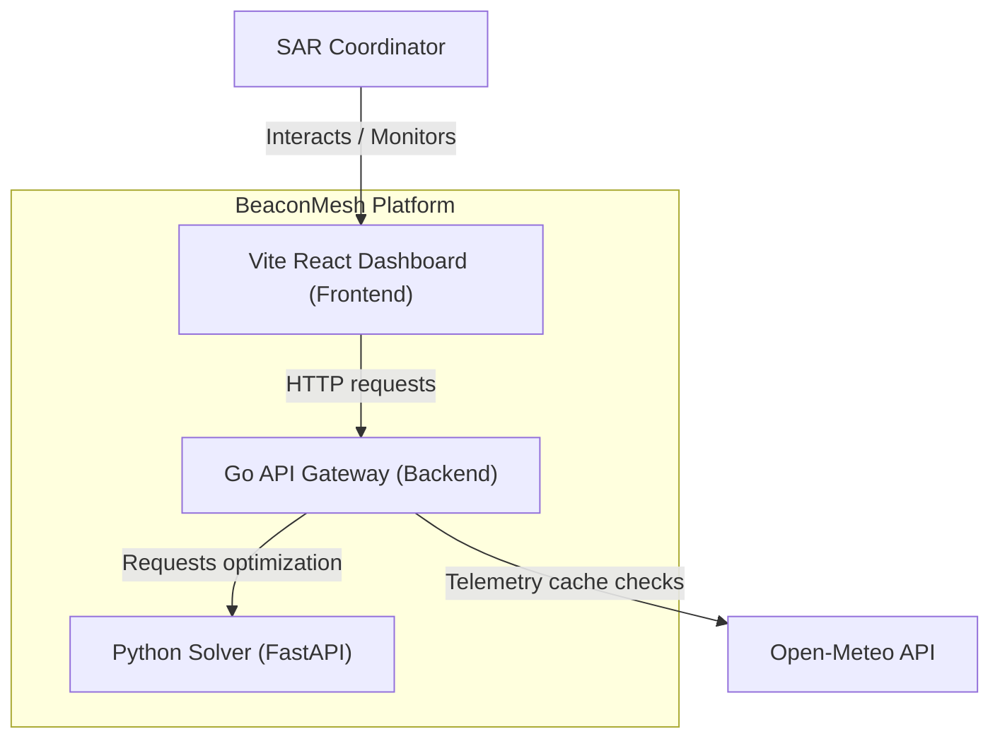
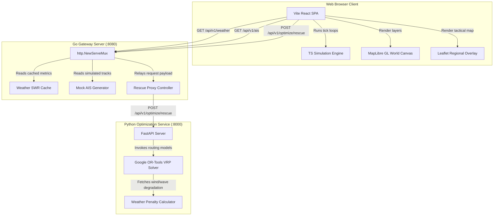
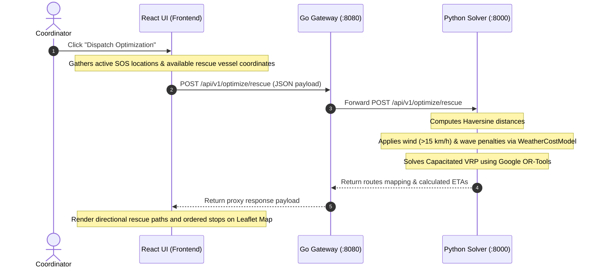

# Architecture Overview

This document serves as the canonical architecture definition for **BeaconMesh**. It describes the system topology, component interactions, technological stack, design principles, and future roadmaps. 

---

## ⚠️ Architectural Reality & Discrepancies

To maintain absolute technical integrity, developers and auditors must note that the active codebase differs from older legacy documentation (`docs/hld.md`, `docs/lld.md`, `docs/prd.md`). Below is the truth-matrix comparing the **Legacy Design Specs** to the **Actual Implementation**:

| Architectural Area | Legacy Design Spec (Outdated) | Actual Implementation (Source of Truth) |
| :--- | :--- | :--- |
| **Frontend Framework** | Next.js (App Router) | React 18 SPA bootstrapped with **Vite** |
| **Map Rendering Engine** | Mapbox GL JS | **MapLibre GL** (WebGL world map with dark matter tiles) and **Leaflet.js** (tactical Mangalore map overlay) |
| **Database Layer** | PostgreSQL + PostGIS database | **Stateless / In-Memory**. Active states are handled in-memory inside React. The Go gateway caches weather telemetry. |
| **Mesh Simulation Engine** | Python simulation loop running event queues | **TypeScript client-side engine** running in the React browser thread (`frontend/src/simulation/`) |
| **Go Backend Scope** | Telemetry, Emergency, & Simulation controller modules | Caching proxy layer managing weather telemetry, local AIS mocks, and optimization request routing |
| **Communication Protocols** | WebSockets + gRPC | Stateless **REST APIs** (JSON over HTTP) with CORS enabled |

---

## 1. Project Vision, System Goals, & Scope

### Project Vision
BeaconMesh provides low-bandwidth, offline-first communication and rescue route optimization for vessels operating beyond cellular coverage. By modeling maritime mesh routing, search and rescue (SAR) centers can coordinates dispatches during breakdowns, sinking, or medical emergencies.

### System Goals
- **Local Autonomy**: Simulate store-carry-forward packet exchanges when nodes are offline.
- **Operational Clarity**: Segregate emergency coordination operations (Mangalore tacticals) from global maritime shipping traffic monitors.
- **Algorithmic Dispatch**: Route rescue vessels to multiple emergency alerts prioritizing medical urgency and minimizing distance.

### Scope
- **Tactical Dashboard**: Maps regional rescue assets, active SOS incidents, and optimizes assignments using weather constraints.
- **Surveillance Center**: Monitors 200+ simulated AIS targets transiting international lanes, visualizes weather overlays, and inspects ship parameters.
- **Decoupled Solvers**: Exposes API integrations for OR-Tools optimization algorithms.

---

## 2. High-Level Architecture

BeaconMesh uses a three-tier decoupling strategy: React frontend client (handles visuals and DTN simulations), Go gateway (caching and API routing), and Python optimizer (OR-Tools solver).

### System Context Diagram (Mermaid)



### Container Diagram (Mermaid)



---

## 3. Component Overview & Data Flow

### Component Directory Mapping

```
┌────────────────────────────────────────────────────────────────────────┐
│                        VITE REACT FRONTEND                             │
│                                                                        │
│ ┌──────────────────────┐ ┌───────────────────────┐ ┌─────────────────┐ │
│ │  MapOverview.tsx     │ │  LiveMapConsole.tsx   │ │  simulation/    │ │
│ │  - Leaflet map       │ │  - MapLibre GL canvas │ │  - engine.ts    │ │
│ │  - Regional tactical │ │  - Clustered global   │ │  - movement.ts  │ │
│ │  - SOS Overlays      │ │  - Filter Dock        │ │  - dtn.ts       │ │
│ └──────────────────────┘ └───────────────────────┘ └─────────────────┘ │
└───────────────────────────────────┬────────────────────────────────────┘
                                    │ HTTP REST Calls
┌───────────────────────────────────▼────────────────────────────────────┐
│                         GO GATEWAY MONOLITH                            │
│                                                                        │
│ ┌──────────────────────┐ ┌───────────────────────┐ ┌─────────────────┐ │
│ │  openmeteo.go        │ │  cache.go             │ │  ais_provider.go│ │
│ │  - Open-Meteo client │ │  - SWR caching loop   │ │  - Trigonometric│ │
│ │                      │ │  - Memory retention   │ │    AIS mock data│ │
│ └──────────────────────┘ └───────────────────────┘ └─────────────────┘ │
└───────────────────────────────────┬────────────────────────────────────┘
                                    │ HTTP REST Calls
┌───────────────────────────────────▼────────────────────────────────────┐
│                       PYTHON FASTAPI SERVICE                           │
│                                                                        │
│ ┌──────────────────────┐ ┌───────────────────────┐                     │
│ │  solver.py           │ │  costs.py             │                     │
│ │  - OR-Tools solver   │ │  - Wave/Wind penalty  │                     │
│ │  - Route mapping     │ │    matrix calculator  │                     │
│ └──────────────────────┘ └───────────────────────┘                     │
└────────────────────────────────────────────────────────────────────────┘
```

### Key Service Interaction Flow (Distress Dispatch)



---

## 4. Subsystem Architectures

### 1. Backend Architecture (Go Gateway)
The Go backend acts as a lightweight, concurrent API orchestrator. It registers HTTP routing endpoints inside [main.go](file:///c:/Users/Gagandeep/project/BeaconMesh/backend/cmd/server/main.go) and executes:
* **SWR Cache (`cache.go`)**: Wraps weather telemetry calls. On request, serves cached data immediately, triggering a background fetch to Open-Meteo if expired (10-minute intervals).
* **Mock AIS Generator (`ais_provider.go`)**: Implements trigonometric coordinates translation loops to update global vessel positions.
* **CORS Middleware**: Implements cross-origin headers (`*`) to allow local developer environments (`:3000`, `:8080`, `:8000`) to communicate seamlessly.

### 2. Frontend Architecture (React / TypeScript)
Constructed as a modular component hierarchy:
* **App Context (`App.tsx`)**: Coordinates state vectors for vessels, active emergencies, search dispatches, weather stats, and panel layout routing.
* **Simulation Loop (`simulation/engine.ts`)**: Dispatches periodic ticks (1-second updates) updating node coordinate positions, checking wireless line-of-sight bounds, replicating buffers via DTN protocols, and managing active search routes.
* **Live Map Console (`LiveMapConsole.tsx`)**: Generates the MapLibre GL world view. Operates circle layers mapping Cargo, Tanker, Passenger, and Military vessels.

### 3. Simulation Engine Architecture (TS client-side)
* **Node Physics (`movement.ts`)**: Resolves heading updates and velocities to drift coordinates correctly.
* **Mesh Network (`dtn.ts`)**: Runs store-carry-forward replication. Nodes exchange summary vectors containing known packet metadata IDs and request missing elements.
* **Mesh Radio (`dtn.ts`)**: Computes connection eligibility based on line-of-sight range criteria (typically 15 km bounds).

### 4. Optimization & Solver Architecture (Python OR-Tools)
Calculates rescue schedules inside [solver.py](file:///c:/Users/Gagandeep/project/BeaconMesh/simulation/src/optimizer/solver.py):
* **Penalty Coefficients (`costs.py`)**: Computes weather penalties based on wind speed and wave height. Wind speed penalties only kick in for values exceeding 15 km/h.
* **Capacity Bounds**: Ensures patient capacities are respected and maps vessel start/end bounds back to respective home ports.

### 5. Database Architecture
* **Current State**: Transient memory mapping. All simulation history, dispatches, and vessel coordinates exist strictly in the client runtime memory state.
* **Schema Blueprint**: Designed in `docs/database_design.md` for future PostGIS integration, utilizing composite spatial index models (e.g. `ST_DWithin`, `ST_Distance`).

---

## 5. Non-Functional Specifications & Design Principles

### Design Principles
- **Offline-First**: All core tracking and packet replication algorithms run locally in the client layer.
- **Polyglot Monorepo**: Separates high-concurrency routing (Go) from scientific mathematical solvers (Python).
- **Stateless Proxying**: The Go server maintains no active state databases, simplifying deployment and recovery metrics.

### Performance Considerations
* **WebGL Acceleration**: Rendering hundreds of commercial vessels uses MapLibre's WebGL canvas layers, avoiding UI lag.
* **Background Cache Refreshing**: Serving weather payloads via SWR caching prevents gateway threads from blocking on external HTTP calls.

### Security Considerations
* **CORS Scope**: Current configuration allows wildcard origins (`*`). Production release checklists require binding origins strictly to authorized domains.
* **DISTRESS Verification (Roadmap)**: Future iterations require cryptographic payload signatures (Ed25519) to prevent spoofed emergency requests.

---

## 6. Architectural Decision Records (ADR Summary)

* **[ADR-001: Offline-First Mesh Routing](file:///c:/Users/Gagandeep/project/BeaconMesh/docs/adr/adr-001-mesh-routing.md)**: Adopts Delay-Tolerant Networking (DTN) and Epidemic Routing (store-carry-forward) for vessel packet exchange.
* **[ADR-002: Modular Monolith Clean Architecture](file:///c:/Users/Gagandeep/project/BeaconMesh/docs/adr/adr-002-modular-monolith-clean-arch.md)**: Organizes the Go backend codebase to isolate core domains from framework elements.
* **[ADR-003: Simulation/Solver Isolation](file:///c:/Users/Gagandeep/project/BeaconMesh/docs/adr/adr-003-simulation-integration.md)**: Segregates optimization solver components into a Python service, using REST wrappers.

---

## 7. Future Evolution

1. **Docker Compose Orchestration**: Integrate multi-container orchestration configs linking frontend, Go gateway, and Python solvers in a unified network.
2. **Persistent Database Layer**: Attach PostgreSQL/PostGIS schemas to backend models, migrating state data away from memory pools.
3. **AIS Data Ingestion**: Transition the Mock AIS provider to retrieve actual live transponder feeds from open APIs.

---

## 8. References
* *Open-Meteo Documentation*: https://open-meteo.com/en/docs
* *Google OR-Tools VRP Solver*: https://developers.google.com/optimization/routing/vrp
* *MapLibre GL API Guide*: https://maplibre.org/maplibre-gl-js/docs/
