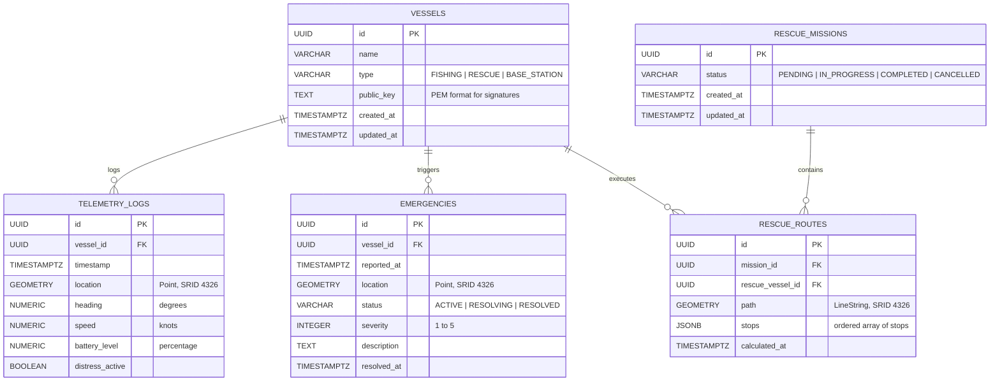

> **⚠️ ARCHIVED — Historical Document**
>
> This document is retained for historical reference only. It describes the **original conceptual design** of BeaconMesh and does **not reflect the current implementation**.
>
> For the current architecture, see **[docs/architecture/architecture-overview.md](../architecture/architecture-overview.md)** — the canonical source of truth.
>
> *Archived: July 2026*

---

# Database Design

## 1. Entity-Relationship Diagram (ERD)



## 2. Table Schemas & PostGIS Implementations

### Enable PostGIS Extension
```sql
CREATE EXTENSION IF NOT EXISTS "uuid-ossp";
CREATE EXTENSION IF NOT EXISTS postgis;
```

### Vessels Table
```sql
CREATE TABLE vessels (
    id UUID PRIMARY KEY DEFAULT uuid_generate_v4(),
    name VARCHAR(100) NOT NULL,
    type VARCHAR(30) NOT NULL CHECK (type IN ('FISHING', 'RESCUE', 'BASE_STATION')),
    public_key TEXT,
    created_at TIMESTAMPTZ DEFAULT CURRENT_TIMESTAMP,
    updated_at TIMESTAMPTZ DEFAULT CURRENT_TIMESTAMP
);
```

### Telemetry Logs Table (Time-Series Spatial tracking)
```sql
CREATE TABLE telemetry_logs (
    id UUID PRIMARY KEY DEFAULT uuid_generate_v4(),
    vessel_id UUID NOT NULL REFERENCES vessels(id) ON DELETE CASCADE,
    timestamp TIMESTAMPTZ NOT NULL,
    location GEOMETRY(Point, 4326) NOT NULL,
    heading NUMERIC(5, 2) NOT NULL,
    speed NUMERIC(4, 2) NOT NULL,
    battery_level NUMERIC(4, 1) NOT NULL,
    distress_active BOOLEAN NOT NULL DEFAULT FALSE,
    created_at TIMESTAMPTZ DEFAULT CURRENT_TIMESTAMP
);

-- Spatial index for geographical range queries
CREATE INDEX idx_telemetry_location ON telemetry_logs USING GIST(location);
-- Composite index for fast lookup of a vessel's recent telemetry
CREATE INDEX idx_telemetry_vessel_time ON telemetry_logs (vessel_id, timestamp DESC);
```

### Emergencies Table
```sql
CREATE TABLE emergencies (
    id UUID PRIMARY KEY DEFAULT uuid_generate_v4(),
    vessel_id UUID REFERENCES vessels(id) ON DELETE SET NULL,
    reported_at TIMESTAMPTZ NOT NULL DEFAULT CURRENT_TIMESTAMP,
    location GEOMETRY(Point, 4326) NOT NULL,
    status VARCHAR(30) NOT NULL DEFAULT 'ACTIVE' CHECK (status IN ('ACTIVE', 'RESOLVING', 'RESOLVED')),
    severity INTEGER NOT NULL CHECK (severity BETWEEN 1 AND 5),
    description TEXT,
    resolved_at TIMESTAMPTZ
);

CREATE INDEX idx_emergencies_location ON emergencies USING GIST(location);
CREATE INDEX idx_emergencies_status ON emergencies (status);
```

### Rescue Missions & Routes Tables
```sql
CREATE TABLE rescue_missions (
    id UUID PRIMARY KEY DEFAULT uuid_generate_v4(),
    status VARCHAR(30) NOT NULL DEFAULT 'PENDING' CHECK (status IN ('PENDING', 'IN_PROGRESS', 'COMPLETED', 'CANCELLED')),
    created_at TIMESTAMPTZ DEFAULT CURRENT_TIMESTAMP,
    updated_at TIMESTAMPTZ DEFAULT CURRENT_TIMESTAMP
);

CREATE TABLE rescue_routes (
    id UUID PRIMARY KEY DEFAULT uuid_generate_v4(),
    mission_id UUID NOT NULL REFERENCES rescue_missions(id) ON DELETE CASCADE,
    rescue_vessel_id UUID NOT NULL REFERENCES vessels(id) ON DELETE CASCADE,
    path GEOMETRY(LineString, 4326) NOT NULL,
    stops JSONB NOT NULL, -- Array of objects: { "type": "emergency", "id": "uuid", "order": 1 }
    calculated_at TIMESTAMPTZ DEFAULT CURRENT_TIMESTAMP
);

CREATE INDEX idx_rescue_routes_path ON rescue_routes USING GIST(path);
```

## 3. Reference Spatial Queries

### Query 1: Find all vessels within 15 km of a specific coordinate
To detect mesh propagation neighbors:
```sql
SELECT 
    v.id, 
    v.name,
    v.type,
    ST_Distance(t.location::geography, ST_MakePoint(-70.1234, 42.5678)::geography) AS distance_meters
FROM vessels v
JOIN LATERAL (
    SELECT location 
    FROM telemetry_logs 
    WHERE vessel_id = v.id 
    ORDER BY timestamp DESC 
    LIMIT 1
) t ON TRUE
WHERE ST_DWithin(t.location::geography, ST_MakePoint(-70.1234, 42.5678)::geography, 15000);
```

### Query 2: Get Latest Telemetry Position for all Active Vessels
```sql
SELECT DISTINCT ON (vessel_id) 
    vessel_id, 
    timestamp, 
    ST_Y(location) AS latitude, 
    ST_X(location) AS longitude, 
    heading, 
    speed, 
    battery_level, 
    distress_active
FROM telemetry_logs
ORDER BY vessel_id, timestamp DESC;
```
