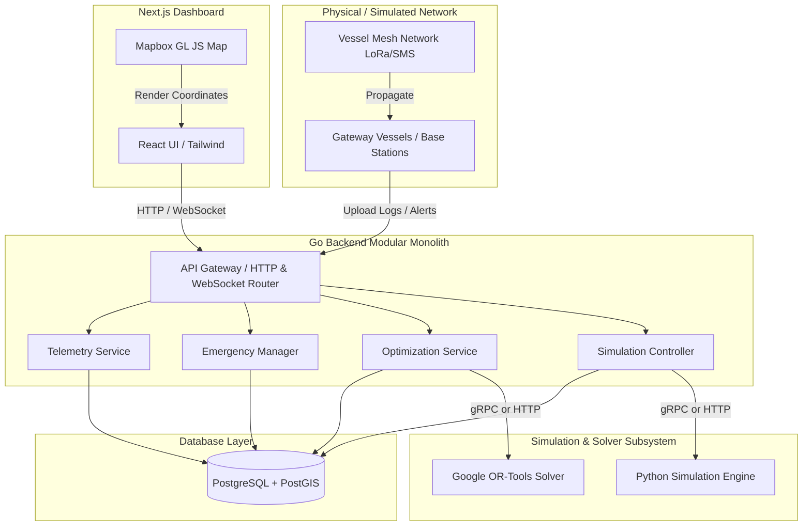

> **⚠️ ARCHIVED — Historical Document**
>
> This document is retained for historical reference only. It describes the **original conceptual design** of BeaconMesh and does **not reflect the current implementation**.
>
> For the current architecture, see **[docs/architecture/architecture-overview.md](../architecture/architecture-overview.md)** — the canonical source of truth.
>
> *Archived: July 2026*

---

# High-Level Design (HLD)

## 1. System Architecture Diagram

## 2. Component Descriptions

### Go Backend (Modular Monolith)
Implemented in Go to achieve high concurrency, small footprint, and low-latency API handling. Divided into distinct modules using clean architecture guidelines:
* **Telemetry Service**: Stores and updates vessel positions. Keeps track of historic tracks for trajectory display.
* **Emergency Manager**: Manages distress logs. Receives alerts from gateways, triggers notifications, and coordinates search tasks.
* **Optimization Service**: Acts as a client to the OR-Tools solver. Feeds current vessel coordinates, sea states, and rescue assets to Python and stores the resulting paths.
* **Simulation Controller**: Provides API endpoints to start, pause, configure, and inspect the Python-driven mesh simulation.

### PostgreSQL + PostGIS Database
* Relational engine chosen for standard transaction integrity.
* PostGIS extension is used to handle maritime spatial coordinates (`GEOMETRY(Point, 4326)` for vessel logs, `GEOMETRY(LineString, 4326)` for paths, and `GEOMETRY(Polygon, 4326)` for search regions).

### Python Simulation & Solver Subsystem
* Python is selected for its robust scientific, simulation, and optimization libraries.
* **Simulation Engine**: Runs discrete-event simulation models representing vessels moving, broadcasting packets, and testing store-carry-forward algorithms under varying radio range metrics.
* **Google OR-Tools**: Executes the Capacitated Vehicle Routing Problem with Time Windows (CVRPTW) algorithm to recommend optimal paths for dispatching rescue vessels.

### Next.js Frontend
* A single-page application built on Next.js, React, and TypeScript.
* Utilizes **Mapbox GL JS** for rendering interactive spatial maps of vessel locations, historical tracks, active distress zones, and optimized rescue paths.

## 3. Communication Protocols
* **Vessel -> Mesh -> Gateway**: Simulated custom binary packets over simulated LoRa/SMS.
* **Gateway -> Go Backend**: REST API (HTTPS) for payload uploads.
* **Frontend -> Go Backend**: REST API for configuration and historical query; WebSocket connection for live telemetry updates and new alert events.
* **Go Backend -> Python Simulation/Solver**: gRPC/Protobuf or REST over local loopback for performance and clean data structures.
